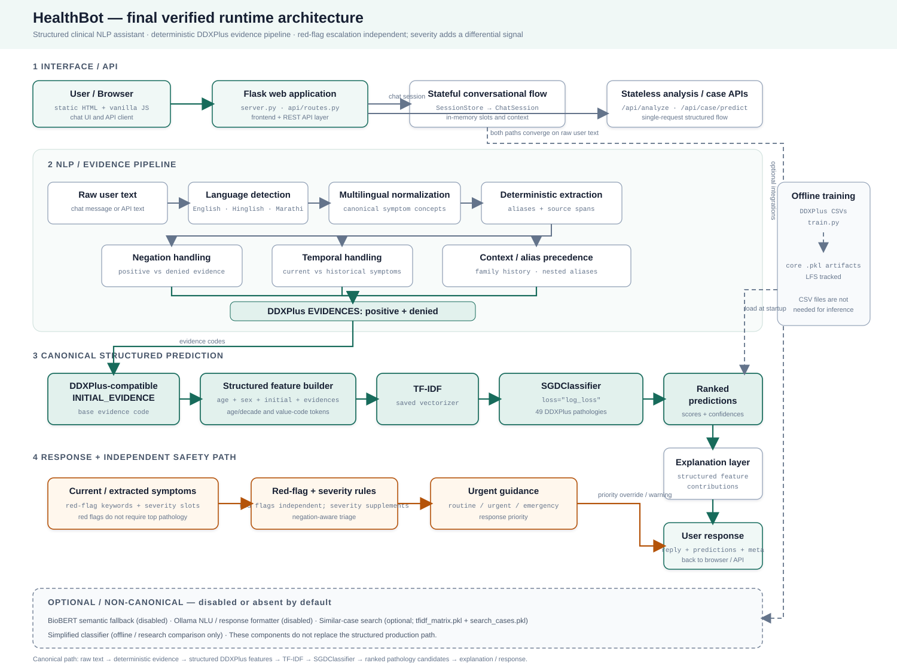

# Architecture

This document is written to be presentable: it explains *why* each piece
exists, not just what it does, so you can walk someone through the system
end to end.



*(Regenerate with `python3 docs/generate_architecture_diagram.py` if the
architecture changes — it's a plain-Python SVG generator, no
matplotlib/graphviz dependency.)*

## Request lifecycle, step by step

1. **Browser (`static/`)** — A user types a symptom sentence into the chat
   composer. No framework, no build step: `index.html` + `style.css` +
   `app.js` (vanilla JS, `fetch`-based). The page holds a `session_id` in
   `localStorage` so a reload doesn't lose the conversation.

2. **Flask API (`api/routes.py`)** — `POST /api/chat/message` receives
   `{session_id, message}`. This layer contains **no clinical logic** — it
   only translates HTTP into calls against the modules below and serializes
   their output back to JSON.

3. **Session store (`chatbot/session_store.py`)** — Maps `session_id` to an
   in-memory `ChatSession` object. HTTP is stateless; a multi-turn symptom
   conversation isn't, so this is the seam between the two. Documented
   limitation: single-process only (see the module docstring for the Redis
   upgrade path if you ever run multiple workers).

4. **Chat state machine (`chatbot/bot.py::ChatSession`)** — The conversational
   brain. Tracks which clinical "slots" have been filled (main symptom,
   duration, severity, age, sex, pain location, and relevant history), decides
   whether to ask a clarifying
   question or commit to an assessment, and orchestrates every NLP/ML step
   below for each turn.

5. **NLP utilities** — Run (mostly) in parallel for each message:
   - `utils/language_detector.py` — English / Hinglish / Marathi
     (Devanagari) / Romanized Marathi, by script + keyword scoring.
   - `utils/multilingual_normalizer.py` — maps symptom phrases in any of
     those languages to canonical English terms (exact phrase match, then
     `utils/fuzzy_symptom_matcher.py` for near-misses).
   - `utils/negation.py` — a small, dependency-free NegEx-style negation
     detector (trigger phrase + bounded scope + pseudo-negation guard), so
     "no chest pain" is never counted as chest pain. Why not
     scispaCy/medspaCy: those are excellent but pull in spaCy + a
     biomedical model for something this project does with regex and a
     6-word scope window — see the module docstring for the full trade-off.
   - `utils/red_flag_rules.py` — negation-aware keyword triage for
     emergency/urgent symptoms (chest pain, breathing difficulty, etc.),
     independent of the ML model.
   - `utils/ddxplus_decoder.py` — the bidirectional bridge between human
     text and the official DDXPlus evidence-code vocabulary: decodes codes
     into readable questions, and infers codes from a symptom sentence via
     an alias index built from the metadata itself.

6. **Structured ML predictor (`model/predictor.py`)** — Builds a feature
   string from `{age, sex, initial_evidence, evidences}`
   (`utils/clinical_case_features.py`), runs it through the trained TF-IDF
   vectorizer + classifier, and returns a ranked list of pathologies with
   confidence scores. Also exposes `explain_case()` — see below.

7. **Severity & response (`utils/severity_engine.py`,
   `utils/response_summarizer.py`, `utils/ollama_client.py`)** — The
   severity engine is a *second*, independent safety signal: it checks the
   official DDXPlus per-pathology severity rating against the model's
   current top-k differential, so a high-acuity condition still surfaces a
   warning even if it's not the top-ranked prediction and even if no
   keyword red flag matched. The response is then formatted — by the
   deterministic template summarizer by default, or by a local Ollama
   model if explicitly enabled, gated by a grounding verifier that rejects
   any rewrite naming an unsupported disease or a drug dosage.

8. **Back to the browser** — The API returns `{reply, meta}`; `meta`
   carries the structured predictions, red-flag status, severity message,
   language detection, and the explanation, which the insight panel
   renders live next to the chat.

## Why a linear model, and why that makes explainability free

`model/train.py` compares a Multinomial Naive Bayes baseline against a
linear `SGDClassifier` (log-loss), and an optional LightGBM candidate, by
top-5 validation accuracy — see `saved_models/model_comparison.csv` for the
actual numbers from the last training run. The linear model has won every
run so far on this feature set.

That matters beyond accuracy: a linear model's prediction is *exactly*

```
score(class) = Σ tfidf_weight(token) × coefficient(token, class)
```

`explain_case()` in `model/predictor.py` computes precisely that sum,
per-token, for one case — no sampling, no approximation, no SHAP/LIME
dependency. Each surviving token (after filtering bigrams and one
redundant derived flag) is translated back into a human-readable phrase via
`utils/ddxplus_decoder.py`, including reconstructing the original evidence
code from a TF-IDF token that collapsed DDXPlus's `_@_` value separator
during vectorization (see the function's docstring for that specific
detail — it's the one non-obvious bit in an otherwise direct calculation).

If a future non-linear candidate (the optional LightGBM path) is ever
selected instead, `explain_case()` fails closed: it returns an explicit
`"explanation unavailable for this model"` note rather than a wrong or
approximated one. Correctness of the *absence* of an explanation is as
important as correctness of the explanation itself.

## Offline training pipeline

`model/train.py` is independent of the running app: it reads
`data/{train,validate,test}.csv`, builds the TF-IDF feature space from
`{age_bucket, decade_bucket, sex, initial_evidence, evidence_codes}`
(deliberately **excluding** `DIFFERENTIAL_DIAGNOSIS`, which would leak the
answer), fits and compares candidate models, and writes everything the
running app needs to `saved_models/`: the vectorizer, classifier, label
encoder, a TF-IDF similarity index + case records for the optional "similar
cases" feature, and `model_metadata.json` (which `model/predictor.py` checks
when the core predictor is first used to detect a stale or missing model).

The runtime requires the three core classifier artifacts and
`model_metadata.json`. Missing `tfidf_matrix.pkl` or `search_cases.pkl`
disables similar-case search only; it does not trigger retraining. The
simplified classifier is retained for offline comparison and is not used by
the canonical chatbot prediction path.

## Validation notes carried over from the pre-Flask refactor

These are worth knowing before presenting the severity engine or the
chatbot's clarification logic:

- **Severity polarity is config, not assumption.** DDXPlus's public docs
  don't make obvious which end of the 1-5 severity scale is "more severe."
  `utils/severity_engine.py` defaults to `SEVERE_END = "low"` based on the
  one citably-confirmed data point available (Myasthenia gravis = 3, a
  mid-scale chronic condition), and ships `describe_severity_scale()`
  specifically so this can be visually re-confirmed against your own copy
  of `release_conditions.json` before being trusted.
- **The chatbot's clarification policy is currently rule-based** (ask for
  duration, then severity, then age group, capped at
  `MAX_CLARIFICATION_TURNS`), not an entropy/information-gain policy over
  the classifier's current uncertainty. That's a reasonable next iteration
  if you want to extend this project further — the hook point is
  `ChatSession._next_detail_to_ask()` in `chatbot/bot.py`.

## What changed in this refactor round

See `docs/CHANGELOG.md` for the full list. In short: Gradio is gone,
replaced by `api/routes.py` (Flask) + `static/` (HTML/CSS/JS); chat state
now survives across stateless HTTP requests via `chatbot/session_store.py`;
`explain_case()` is new; one-off audit/evaluation scripts that had already
done their job (their findings are now permanent features — the severity
engine, negation handling, calibration notes above) were removed rather
than carried forward as dead weight; and the dependency list was split into
a light `requirements.txt` and an opt-in `requirements-optional.txt`.
