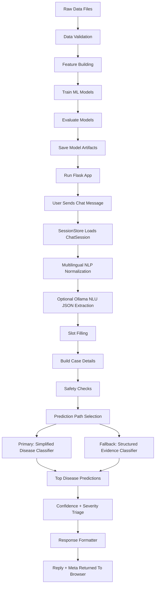
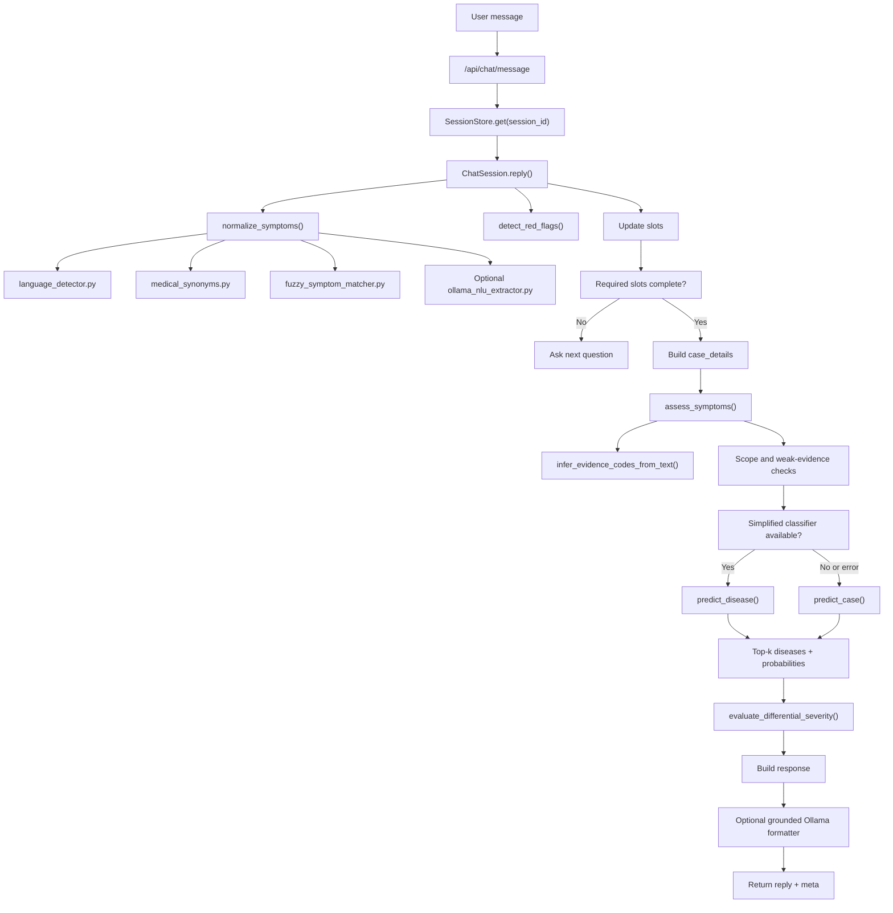
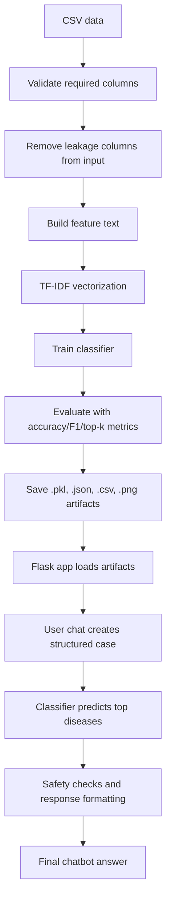

# Data To Training To Prediction Flow

This document explains the complete project flow from data loading to model
training to live chatbot prediction. It is grounded in the current codebase and
does not add any architecture that is not present in the project.

The project currently has two supervised ML pipelines:

1. **Primary chat classifier**: simplified disease classifier used by the
   conversational chatbot when all clinical slots are collected.
2. **Structured DDXPlus evidence classifier**: older/advanced structured
   evidence-code model used as fallback and by `/api/case/predict`.

Both are non-RAG. No retrieval pipeline is used for disease prediction.

## One Vertical End-To-End Flow



Why each high-level stage exists:

| Stage | Why it exists |
|---|---|
| Raw data files | Source clinical examples used to train supervised models. |
| Data validation | Prevents training on missing or wrong columns. |
| Leakage removal | Keeps the model honest by excluding fields that already contain answer-like disease names. |
| Feature building | Converts raw clinical columns into a consistent ML input format. |
| Model training | Learns the relationship between symptoms/case details and disease labels. |
| Evaluation | Measures whether the model is actually learning useful patterns. |
| Artifact saving | Allows the app to load trained models instantly without retraining. |
| Flask app runtime | Serves the model through a usable browser/API interface. |
| Session management | Lets the chatbot remember previous answers in a multi-turn conversation. |
| Multilingual NLP | Converts English, Hinglish, Marathi, and Romanized Marathi into model-friendly English symptoms. |
| Slot filling | Collects missing clinical details such as age, severity, duration, and history. |
| Safety checks | Handles urgent warning signs separately from disease prediction. |
| Prediction path selection | Uses the primary simplified classifier when available and fallback structured model otherwise. |
| Confidence and severity triage | Separates strong predictions from weak matches and adds safety warnings. |
| Response formatting | Converts structured model output into a clear chatbot answer. |

## Pipeline 1: Primary Chat Classifier

This is the main model used by the chatbot after it collects patient details.

### Training File

```text
model/train_disease_classifier.py
```

### Input Data

```text
data/simplified_train.csv
```

Current config:

```text
SIMPLIFIED_TRAIN_ROWS = 100000
```

### Required Input Columns

Used by the trainer:

```text
age
gender
symptoms_text
pain_location
previous_disease_or_history
genetic_or_family_history
disease
```

### Target Column

```text
disease
```

### Columns Excluded To Avoid Leakage

```text
case_text
differential_diagnosis
severity
```

Why:

- `case_text` contains the disease name.
- `differential_diagnosis` contains disease candidates.
- `severity` is official disease severity, not user symptom severity.

### Feature Engineering

The trainer builds a single `model_input` text field using:

```text
age
gender
symptoms_text
pain intensity extracted from symptoms_text
pain_location
previous_disease_or_history
genetic_or_family_history
```

Pain intensity is extracted with regex:

```text
pain intensity: 0-10
```

Then the final model text looks like:

```text
age: 45 gender: M symptoms: chest pain shortness of breath
duration: unknown severity: pain intensity: 8
pain location: chest previous disease: diabetes
family history: family heart disease
```

### Train/Test Split

Method used:

```text
train_test_split
```

Parameters:

```text
test_size = 0.2
random_state = 42
stratify = disease
```

Purpose:

- Keep class distribution similar in train and test.
- Make results reproducible.

Why this method is used:

- A random split without `stratify` could accidentally put fewer examples of a
  rare disease into the test set.
- `random_state=42` makes the result repeatable, which is important when
  explaining metrics in an interview.
- A simple train/test split is enough here because this trainer is a focused
  supervised classifier, not a complex hyperparameter search pipeline.

### ML Algorithm

Pipeline:

```text
TfidfVectorizer + LogisticRegression
```

Exact configuration:

```text
TfidfVectorizer(
    max_features=50000,
    ngram_range=(1, 2),
    min_df=2
)

LogisticRegression(
    max_iter=1000,
    class_weight="balanced",
    n_jobs=-1
)
```

Techniques used:

- TF-IDF text vectorization.
- Unigram + bigram features.
- Logistic Regression multiclass classification.
- Balanced class weights.
- Stratified split.

Why each method is used:

| Method/setting | Why it is used |
|---|---|
| `TfidfVectorizer` | Converts clinical text into numeric sparse features that scikit-learn models can learn from. It is fast, explainable, and works well for symptom phrases. |
| `max_features=50000` | Limits vocabulary size so the model stays memory-efficient while still keeping many useful symptom/history terms. |
| `ngram_range=(1, 2)` | Uses single words and two-word phrases. This matters because phrases like `chest pain`, `sore throat`, and `family history` carry meaning that single words alone may lose. |
| `min_df=2` | Removes one-off terms that appear only once. This reduces noise and overfitting. |
| `LogisticRegression` | A strong baseline for multiclass text classification. It gives class probabilities through `predict_proba()` and is easier to explain than a deep model. |
| `class_weight="balanced"` | Helps when disease classes are not perfectly balanced by giving more weight to underrepresented classes. |
| `max_iter=1000` | Gives the optimizer enough iterations to converge on a larger TF-IDF feature space. |
| `n_jobs=-1` | Uses available CPU cores to speed up training. |

Why this is better than an LLM for disease prediction:

- The dataset is labeled, so this is a supervised classification problem.
- The classifier predicts only among the trained disease classes.
- The model output is controlled and testable.
- An LLM may generate disease names outside the training label set.

### Evaluation Metrics

Computed in `model/train_disease_classifier.py`:

```text
accuracy
macro_f1
weighted_f1
classification_report
```

Current saved metrics:

```text
accuracy = 0.99505
macro_f1 = 0.993699454076717
weighted_f1 = 0.9949762548282404
```

### Generated Files

Generated by this training script:

```text
saved_models/simplified_disease_classifier.pkl
saved_models/simplified_disease_classifier_metadata.json
```

Use of each file:

| File | Use |
|---|---|
| `simplified_disease_classifier.pkl` | Saved scikit-learn Pipeline used for disease prediction |
| `simplified_disease_classifier_metadata.json` | Stores model type, training rows, input columns, metrics, and class names |

### Prediction File

```text
model/predict_disease.py
```

Prediction method:

1. Load `simplified_disease_classifier.pkl`.
2. Build the same model input format with `build_model_input()`.
3. Run `predict_proba()`.
4. Sort classes by probability.
5. Return top diseases with confidence.

Confidence flag logic:

```text
HIGH   >= 0.60
MEDIUM >= 0.30
LOW    < 0.30
```

This is the primary model path used by the chatbot when `case_details` are
available and the simplified classifier artifact exists.

Why `predict_proba()` is used:

- The chatbot needs ranked disease candidates, not just one label.
- Probabilities let the UI show confidence percentages.
- The top probability and margin help decide whether the answer should be
  treated as high, medium, or low confidence.

## Pipeline 2: Structured DDXPlus Evidence Classifier

This is the structured evidence-code classifier. It is used by the developer
endpoint and as fallback when the simplified classifier is not available or
fails.

### Training File

```text
model/train.py
```

### Input Data

```text
data/train.csv
data/validate.csv
data/test.csv
```

Current saved metadata:

```text
train_rows_used = 200001
validate_rows_used = 49999
test_rows_used = 49999
```

### Required Columns

Defined in `utils/clinical_case_features.py`:

```text
AGE
SEX
PATHOLOGY
EVIDENCES
INITIAL_EVIDENCE
DIFFERENTIAL_DIAGNOSIS
```

### Target Column

```text
PATHOLOGY
```

### Excluded Input Column

```text
DIFFERENTIAL_DIAGNOSIS
```

Why:

- It already contains disease candidates and would leak the answer.
- It is only kept for reference/similar-case display.

### Data Loading And Validation

Method:

```text
pandas.read_csv()
```

Validation:

- Check file exists.
- Check all required columns exist.
- Print row count and pathology count.

Why this method is used:

- `pandas.read_csv()` is the standard practical tool for CSV datasets.
- Required-column checks prevent silent training on the wrong schema.
- Printing row and class counts makes training easier to audit.

### Stratified Sampling

Function:

```text
stratified_sample()
```

Purpose:

- Limit training/search size if configured.
- Preserve pathology distribution.
- Backfill missing labels if sampling removes a class.

Why stratified sampling is used:

- The dataset has many disease classes, so random sampling could drop rare
  pathologies.
- Stratification keeps the sampled set closer to the full dataset distribution.
- Backfilling ensures every disease class remains represented after sampling.

### Feature Engineering

File:

```text
utils/clinical_case_features.py
```

The raw structured case is converted into feature tokens:

```text
age_bucket(age)
decade_bucket(age)
sex_M / sex_F / sex_U
initial_<evidence_code>
ev_<evidence_code>
evbase_<base_code>
evval_<value_code>
initial_in_evidence_<code>
```

Example:

```text
age_adult_40_64 age_decade_50 sex_M initial_E_66 ev_E_66 ev_E_91
```

Techniques used:

- Age bucketing.
- Decade bucketing.
- Sex normalization.
- Evidence-code tokenization.
- Initial-evidence feature.
- Value-code decomposition for categorical evidence.

Why each feature technique is used:

| Technique | Why it is used |
|---|---|
| Age bucketing | Converts raw age into clinically meaningful groups like child, adult, and senior. This is more stable than treating every exact age as a separate token. |
| Decade bucketing | Keeps extra age detail without making the feature too specific. |
| Sex normalization | Converts inconsistent sex values into stable `M`, `F`, or `U` tokens. |
| Evidence-code tokenization | DDXPlus symptoms are structured evidence codes, so code tokens preserve the official clinical signal. |
| Initial-evidence feature | The first/main complaint can be highly informative, so it gets its own token. |
| Value-code decomposition | For categorical evidence, the model can learn both the base question and the selected value. |

### Label Encoding

Method:

```text
LabelEncoder
```

Purpose:

- Convert pathology names into numeric labels for scikit-learn.
- Convert predictions back into disease names at inference.

Why `LabelEncoder` is used:

- scikit-learn classifiers expect numeric class labels internally.
- The encoder stores the exact mapping between disease names and numeric IDs.
- At prediction time, it safely converts model outputs back to human-readable
  pathology names.

Generated file:

```text
saved_models/label_encoder.pkl
```

### Vectorization

Algorithm:

```text
TfidfVectorizer
```

Exact configuration:

```text
TfidfVectorizer(
    lowercase=False,
    token_pattern=r"(?u)\b[A-Za-z0-9_@/+-]+\b",
    ngram_range=(1, 2),
    min_df=2,
    max_features=30000,
    sublinear_tf=True
)
```

Generated file:

```text
saved_models/tfidf_vectorizer.pkl
```

Why this vectorizer configuration is used:

| Setting | Why it is used |
|---|---|
| `lowercase=False` | Evidence tokens such as `E_91` and generated feature prefixes are already controlled; changing case is unnecessary. |
| custom `token_pattern` | Keeps evidence-code characters like `_`, `@`, `/`, `+`, and `-` instead of splitting them incorrectly. |
| `ngram_range=(1, 2)` | Allows the model to learn single evidence tokens and useful two-token combinations. |
| `min_df=2` | Removes extremely rare tokens that may be noise. |
| `max_features=30000` | Controls memory and model size. |
| `sublinear_tf=True` | Reduces the effect of repeated tokens so repeated evidence does not dominate too strongly. |

### Candidate Algorithms

The trainer compares candidate models:

```text
MultinomialNB(alpha=0.05)
SGDClassifier(loss="log_loss", penalty="elasticnet")
Optional LightGBM if USE_LIGHTGBM_CANDIDATE=True
```

SGD configuration:

```text
loss = "log_loss"
penalty = "elasticnet"
alpha = 1e-5
l1_ratio = 0.05
class_weight = "balanced"
max_iter = 60
tol = 1e-3
random_state = TRAIN_RANDOM_STATE
n_jobs = -1
```

Optional LightGBM configuration is present in code but only used if:

```text
USE_LIGHTGBM_CANDIDATE=True
```

and LightGBM is installed.

Why each candidate exists:

| Candidate | Why it is used |
|---|---|
| `MultinomialNB` | Very fast text-classification baseline. It is useful for comparison because it often performs reasonably on TF-IDF/count-style features. |
| `SGDClassifier(loss="log_loss")` | Linear classifier suitable for large sparse TF-IDF matrices. `log_loss` allows probability-style outputs through decision scores. |
| `penalty="elasticnet"` | Combines L1 and L2 regularization, helping with sparse text features and reducing overfitting. |
| `class_weight="balanced"` | Helps classes with fewer examples. |
| Optional `LightGBM` | Included as an optional stronger non-linear candidate, but not required. It is off by default to keep dependencies light. |

Why the current selected model is `sgd_log_loss`:

- It is fast on sparse TF-IDF features.
- It supports an explainable linear coefficient structure.
- The training code prefers an explainable model if it is close to the best
  raw metric winner.

### Model Selection

Function:

```text
select_model_from_comparison()
```

Sort order:

```text
top3_accuracy
macro_f1
top1_accuracy
```

Explainability preference:

```text
EXPLAINABLE_MODEL_TOLERANCE = 0.002
```

Meaning:

- If an explainable linear model is very close to the best raw metric winner,
  the trainer keeps the explainable model.

Why these selection metrics are used:

| Metric | Why it is used |
|---|---|
| `top3_accuracy` | In a symptom checker, the correct condition being in the top few candidates is important because symptoms can overlap. |
| `macro_f1` | Treats all classes more equally, so performance on rare diseases matters. |
| `top1_accuracy` | Measures the exact top prediction quality. |
| explainability tolerance | Avoids choosing a slightly better black-box model when a nearly equal linear model can be explained exactly. |

Current selected model in saved metadata:

```text
sgd_log_loss
```

### Evaluation Metrics

Computed on validation/test:

```text
accuracy
top1_accuracy
macro_f1
weighted_f1
top3_accuracy
top5_accuracy
classification_report
confusion_matrix
```

Why these evaluation outputs are used:

| Output | Why it is used |
|---|---|
| `accuracy` / `top1_accuracy` | Simple measure of exact prediction correctness. |
| `macro_f1` | Shows class-balanced performance, important for multiclass disease prediction. |
| `weighted_f1` | Shows overall performance while accounting for class support. |
| `top3_accuracy` and `top5_accuracy` | Useful because multiple diseases can share symptoms; top-k performance is more realistic for a differential-style assistant. |
| `classification_report.csv` | Gives per-class precision, recall, and F1 for deeper error analysis. |
| `confusion_matrix.png` | Shows which diseases are confused with each other. |

### Generated Files

Generated by `model/train.py`:

```text
saved_models/tfidf_vectorizer.pkl
saved_models/disease_classifier.pkl
saved_models/label_encoder.pkl
saved_models/tfidf_matrix.pkl
saved_models/search_cases.pkl
saved_models/model_comparison.csv
saved_models/model_metadata.json
saved_models/test_metrics.csv
saved_models/classification_report.csv
saved_models/confusion_matrix.png
```

Use of each file:

| File | Use |
|---|---|
| `tfidf_vectorizer.pkl` | Converts structured feature text into TF-IDF vectors |
| `disease_classifier.pkl` | Selected trained structured evidence model |
| `label_encoder.pkl` | Maps numeric class IDs back to pathology names |
| `tfidf_matrix.pkl` | TF-IDF matrix for similar-case search |
| `search_cases.pkl` | Case records used by semantic/similar-case display |
| `model_comparison.csv` | Candidate model comparison metrics |
| `model_metadata.json` | Training metadata, selected model, classes, input features |
| `test_metrics.csv` | Final test metrics for selected model |
| `classification_report.csv` | Per-class precision, recall, and F1 report |
| `confusion_matrix.png` | Top-30 pathology confusion matrix visualization |

Why artifacts are saved:

- `.pkl` files let the app load trained objects without retraining every time.
- `.json` metadata records what was trained, when, and with which columns.
- `.csv` reports make model evaluation reviewable after training.
- `.png` confusion matrix gives a visual error-analysis artifact.

## Live Chat Prediction Flow



## Runtime Methods, Use, And Why

| Method/function | File | Use | Why it is used |
|---|---|---|---|
| `normalize_symptoms()` | `utils/multilingual_normalizer.py` | Converts multilingual symptom text to canonical English symptoms | The ML models are trained on English/structured clinical signals, so user language must be normalized before prediction. |
| `detect_language()` | `utils/language_detector.py` | Detects English/Hinglish/Marathi/Romanized Marathi/mixed | The response and normalization strategy depend on whether the user typed Latin, Devanagari, or mixed text. |
| `fuzzy_match_symptoms()` | `utils/fuzzy_symptom_matcher.py` | Handles near-miss symptom phrases | Users make spelling mistakes and use flexible phrasing; fuzzy matching improves coverage without needing an LLM for every message. |
| `extract_clinical_details()` | `utils/ollama_nlu_extractor.py` | Optional Ollama JSON extraction for multilingual symptoms/slots | Helps with harder Hindi/Marathi/Hinglish text that dictionaries miss, while keeping the LLM away from disease prediction. |
| `detect_red_flags()` | `utils/red_flag_rules.py` | Detects urgent symptom patterns | Safety-critical warning signs should be deterministic, testable, and independent of model confidence. |
| `is_negated()` | `utils/negation.py` | Prevents denied symptoms from being counted | Without negation, text like `no chest pain` could incorrectly trigger chest-pain features and warnings. |
| `infer_evidence_codes_from_text()` | `utils/ddxplus_decoder.py` | Maps symptom text to DDXPlus evidence codes | The structured fallback model expects evidence codes, not raw user text. |
| `build_model_input()` | `model/predict_disease.py` | Builds simplified classifier input text | Training and inference must use the same text format, otherwise predictions become inconsistent. |
| `predict_disease()` | `model/predict_disease.py` | Primary chat disease prediction | Uses the supervised simplified classifier after the chat has collected structured details. |
| `build_case_feature_text()` | `utils/clinical_case_features.py` | Builds structured evidence feature text | Converts age, sex, initial evidence, and evidence codes into the exact feature tokens used during structured-model training. |
| `predict_case()` | `model/predictor.py` | Structured DDXPlus fallback/developer prediction | Keeps support for official evidence-code cases and provides a fallback when the simplified classifier is unavailable. |
| `evaluate_differential_severity()` | `utils/severity_engine.py` | Adds severity-based safety signal | A candidate can be clinically high-acuity even if it is not the top prediction, so severity metadata is checked separately. |
| `summarize_response()` | `utils/response_summarizer.py` | Default safe deterministic reply | Produces a non-hallucinated answer from structured fields without requiring a local LLM. |
| `format_with_ollama()` | `utils/ollama_client.py` | Optional grounded LLM response wording | Improves natural language style, but only after predictions are produced and with a verifier to reject unsupported diseases or dosage advice. |

## What The Main Model Is Used For

### Simplified disease classifier

Used for:

- Main chatbot disease prediction.
- Natural user cases after slots are collected.
- Outputs disease names and model probabilities.

Not used for:

- Red-flag detection.
- Medical diagnosis.
- LLM-style explanation.
- RAG/document retrieval.

### Structured evidence classifier

Used for:

- `/api/case/predict`.
- Structured evidence-code prediction.
- Fallback when simplified classifier is unavailable.
- Similar-case search and exact linear-model explanation support.

Not used as the primary chat model when the simplified classifier is available.

## Complete Data-To-Prediction Summary



## Important Interview Explanation

Say this:

> My project has a clean ML lifecycle. First, CSV clinical data is validated.
> Then leakage columns are excluded. Next, structured fields are converted into
> feature text. TF-IDF creates sparse numerical features. A supervised
> classifier is trained and evaluated. The trained artifacts are saved in
> `saved_models/`. At runtime, the Flask chatbot loads those artifacts, turns
> the user's multilingual symptom conversation into structured case details,
> runs the supervised classifier, adds red-flag and severity safety checks, and
> returns a transparent response with confidence scores.

## What To Avoid Saying

Do not say:

- "The LLM predicts the disease."
- "This is a RAG chatbot."
- "The chatbot diagnoses patients."
- "The model uses every medical condition in the world."

Say instead:

- "The LLM is optional and only extracts or formats."
- "Disease prediction is supervised classification."
- "The result is a possible model match, not a diagnosis."
- "The model predicts among the 49 trained disease classes."
