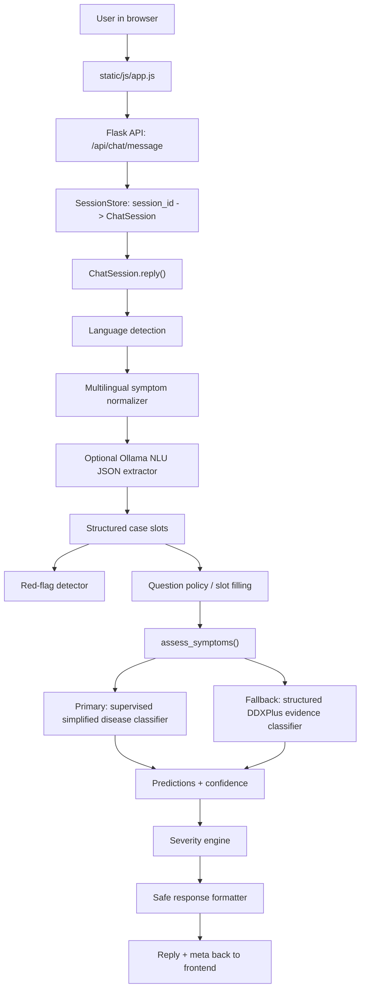

# HealthBot Project Interview Guide

This file is a deep explanation of the current HealthBot project. Use it to
prepare for interviews, demos, viva questions, or project walkthroughs.

The project is a local, non-RAG healthcare NLP assistant. It takes symptoms in
English, Hinglish, Marathi, Romanized Marathi, and partially Hindi-style text,
normalizes them into clinical features, collects important case details, runs a
supervised disease classifier, checks safety signals, and returns a cautious
chatbot answer.

Important disclaimer: this is an educational symptom-checker project. It does
not provide a medical diagnosis and should not replace a qualified clinician.

## 1. Short Interview Pitch

HealthBot is a multilingual healthcare NLP assistant built with Flask,
scikit-learn, and local optional Ollama models. It is intentionally non-RAG:
it does not retrieve documents or ask an LLM to diagnose. The disease
prediction comes from supervised ML trained on DDXPlus-style clinical cases.
The chatbot layer handles language normalization, slot filling, red-flag
triage, severity checks, and safe response generation.

The main idea is:

> User symptoms -> multilingual normalization -> structured clinical details
> -> supervised disease classifier -> red-flag and severity safety layer
> -> transparent chatbot response.

## 2. What Problem This Project Solves

Many symptom checker demos directly send raw text to an LLM. That creates risk:
the model may hallucinate diseases, ignore negation, or provide unsafe advice.
This project avoids that by separating responsibilities:

- NLP extracts symptoms and clinical details.
- Supervised ML predicts possible diseases.
- Rule-based safety logic detects urgent warning signs.
- Optional LLMs are only used for extraction or wording, not diagnosis.

This makes the system more explainable and safer for a portfolio-level
healthcare AI project.

## 3. Current High-Level Architecture



## 4. Main Runtime Flow

### Step 1: Frontend sends chat message

The browser UI lives in:

- `static/index.html`
- `static/css/style.css`
- `static/js/app.js`

The frontend calls:

- `POST /api/chat/start`
- `POST /api/chat/message`
- `POST /api/chat/reset`
- `GET /api/meta`

It receives a chatbot reply and a `meta` object containing predictions, red
flags, confidence, language detection, and severity triage.

### Step 2: Flask API routes the request

Main API file:

- `api/routes.py`

The chat endpoint receives:

```json
{
  "session_id": "...",
  "message": "I have fever and cough"
}
```

Then it loads the correct `ChatSession` from the session store and calls:

```python
session.reply(message)
```

### Step 3: SessionStore keeps conversation memory

File:

- `chatbot/session_store.py`

Flask requests are stateless, but a chatbot needs memory. The session store
maps:

```text
session_id -> ChatSession object
```

It remembers previously collected values such as age, gender, symptoms,
duration, severity, previous disease, and family history.

Current limitation: the store is in-memory and single-process. For production,
it should be replaced by Redis or a database-backed store.

### Step 4: ChatSession manages conversation state

File:

- `chatbot/bot.py`

`ChatSession.reply()` is the conversation state machine.

It does these things:

1. Handles greeting, reset, thanks, and help messages.
2. Normalizes symptoms.
3. Detects red flags.
4. Updates filled slots.
5. Asks the next missing clinical question.
6. Builds `case_details`.
7. Calls `assess_symptoms()`.
8. Formats the final response.

Current required slots:

```text
age
gender
symptom severity
pain location
symptom duration
previous disease/history
family history
```

These are collected before the supervised disease classifier runs in the chat
flow.

## 5. NLP and Language Handling

### Language detection

File:

- `utils/language_detector.py`

Method used:

- Script detection for Devanagari.
- Keyword matching against language-specific symptom maps.
- Labels include:
  - `english`
  - `hinglish`
  - `marathi_devanagari`
  - `romanized_marathi`
  - `mixed`

This is deterministic and lightweight. It does not require an external API.

### Multilingual symptom normalization

Files:

- `utils/medical_synonyms.py`
- `utils/multilingual_normalizer.py`
- `utils/fuzzy_symptom_matcher.py`

The system maps multilingual phrases to canonical English symptoms.

Examples:

```text
bukhar -> fever
sar dard -> headache
khansi -> cough
gala kharab -> sore throat
taap -> fever
dokedukhi -> headache
खोकला -> cough
ताप -> fever
डोकेदुखी -> headache
```

The model ultimately receives normalized English terms.

### Optional Ollama NLU extractor

File:

- `utils/ollama_nlu_extractor.py`

Config:

```env
OLLAMA_NLU_ENABLED=True
OLLAMA_NLU_MODEL=qwen3.5:9b
```

Purpose:

- Extract symptoms and clinical slots from Hindi, Hinglish, Marathi,
  Romanized Marathi, or mixed text.
- Return strict JSON.
- Validate symptoms against known canonical symptom names.
- Never predict disease.

Example output:

```json
{
  "symptoms": ["fever", "cough"],
  "age": 35,
  "gender": "M",
  "duration": "2 days",
  "severity": "moderate",
  "pain_location": "chest",
  "previous_disease": "diabetes",
  "family_history": "none"
}
```

Best explanation in interview:

> I use LLMs only as an NLU extractor for difficult multilingual text. The LLM
> cannot diagnose. The final disease prediction still comes from a supervised
> classifier.

### Optional BioBERT semantic matcher

File:

- `utils/biobert_embedder.py`

Config:

```env
BIOBERT_ENABLED=True
```

Purpose:

- Semantic fallback for symptom aliases.
- Heavy and off by default.

Use in interview:

> BioBERT is optional because I wanted the base app to stay lightweight. The
> deterministic dictionary and fuzzy matcher are the default path.

## 6. Disease Prediction Models

The project currently has two ML prediction paths.

### Primary chat model: simplified supervised disease classifier

Files:

- `model/train_disease_classifier.py`
- `model/predict_disease.py`
- `saved_models/simplified_disease_classifier.pkl`
- `saved_models/simplified_disease_classifier_metadata.json`

Model:

```text
TF-IDF Vectorizer + Logistic Regression
```

Training data:

```text
data/simplified_train.csv
```

Rows used in current artifact:

```text
100,000
```

Target:

```text
disease
```

Input fields:

```text
age
gender
symptoms_text
duration
severity
pain_location
previous_disease_or_history
genetic_or_family_history
```

Important anti-leakage decision:

These columns are excluded:

```text
case_text
differential_diagnosis
severity
```

Reason:

- `case_text` contains the disease name.
- `differential_diagnosis` contains answer-like disease labels.
- The original `severity` column is disease severity, not the user's symptom
  severity.

Current saved metrics:

```text
accuracy: 0.99505
macro_f1: 0.993699454076717
weighted_f1: 0.9949762548282404
```

How prediction works:

1. Build one model input string from structured fields.
2. Vectorize with TF-IDF.
3. Use Logistic Regression probabilities.
4. Return top diseases with confidence scores.

Example model input:

```text
age: 45 gender: M symptoms: chest pain shortness of breath
duration: 2 days severity: pain intensity: 8
pain location: chest previous disease: diabetes
family history: family heart disease
```

Why this model is suitable:

- Fast.
- Explainable enough for a portfolio project.
- Works well on sparse clinical text.
- Does not require GPU.
- Easy to retrain.

### Fallback/advanced model: structured DDXPlus evidence classifier

Files:

- `model/train.py`
- `model/predictor.py`
- `utils/clinical_case_features.py`
- `utils/ddxplus_decoder.py`
- `saved_models/disease_classifier.pkl`

Selected model in saved metadata:

```text
sgd_log_loss
```

Training mode:

```text
structured_clinical_evidence_v1
```

Rows used in current artifact:

```text
train: 200001
validate: 49999
test: 49999
```

Input columns:

```text
AGE
SEX
INITIAL_EVIDENCE
EVIDENCES
```

Excluded input:

```text
DIFFERENTIAL_DIAGNOSIS
```

Reason:

- It would leak answer information into the model.

This model is used mainly when:

- The simplified classifier is unavailable.
- The structured developer endpoint `/api/case/predict` is used.
- Evidence-code style prediction is needed.

## 7. Red Flags and Safety Layer

### Red flag rules

File:

- `utils/red_flag_rules.py`

Purpose:

- Detect warning signs such as severe chest pain, breathing difficulty, and
  other urgent patterns.
- Uses negation handling so "no chest pain" is not treated as chest pain.

Method:

- Rule-based keyword matching.
- Uses normalized text plus original text.
- Uses `utils/negation.py` to avoid false positives.

Interview explanation:

> I kept red-flag detection rule-based because safety logic should be
> deterministic, testable, and not dependent on LLM randomness.

### Negation detection

File:

- `utils/negation.py`

Examples handled:

```text
no chest pain
chest pain nahi hai
छातीत दुखणे नाही
```

Why it matters:

Without negation handling, a model may count a denied symptom as present.

### Severity engine

File:

- `utils/severity_engine.py`

Purpose:

- Uses DDXPlus condition severity metadata as a second safety signal.
- If a high-acuity condition appears in the model candidate list, the bot can
  warn the user cautiously.

Important detail:

- It does not diagnose.
- It does not override the classifier.
- It only adds a safety message.

Interview answer:

> The severity engine is independent of red-flag keywords. Red flags come from
> user text; severity comes from the candidate disease list and official
> condition metadata.

## 8. Response Generation

### Default response formatter

File:

- `utils/response_summarizer.py`

Purpose:

- Deterministic response generation.
- No hallucination risk because it only renders structured fields already
  produced by the system.

### Optional Ollama response formatter

File:

- `utils/ollama_client.py`

Config:

```env
OLLAMA_ENABLED=True
USE_OLLAMA_RESPONSE_FORMATTER=True
OLLAMA_MODEL=medgemma:4b
```

Purpose:

- Make final answers more natural.
- Match English, Hinglish, or simple Marathi style.

Safety guard:

- `verify_grounded_response()` rejects responses that:
  - mention medicine dosage
  - invent disease names outside current predictions

Interview explanation:

> Even when I use Ollama for wording, I verify the response so it cannot add
> unsupported diseases or unsafe dosage advice.

## 9. Complete Chat Flow Example

User:

```text
I have chest pain and shortness of breath
```

Bot collects:

```text
Age?
Gender?
Severity?
Pain location?
Duration?
Previous disease?
Family history?
```

Final model input:

```text
age: 45
gender: M
symptoms: chest pain; shortness of breath
severity: 8/10
pain location: chest
duration: 2 days
previous disease: diabetes
family history: family heart disease
```

Output:

```text
Top model matches:
1. Unstable angina
2. Stable angina
3. Pulmonary neoplasm

Safety:
Chest pain + shortness of breath triggers urgent red-flag advice.
```

The bot also shows:

```text
Details used by model: age: 45; gender: male; symptoms: ...
```

This makes the system transparent.

## 10. API Endpoints

Main endpoints:

| Endpoint | Purpose |
|---|---|
| `GET /api/health` | Check app health |
| `GET /api/meta` | Model metadata and feature status |
| `POST /api/chat/start` | Start chatbot session |
| `POST /api/chat/message` | Send a chat turn |
| `POST /api/chat/reset` | Reset chat session |
| `POST /api/analyze` | One-shot symptom analysis |
| `POST /api/case/predict` | Structured evidence prediction |
| `POST /api/case/from-text` | Convert free text to evidence codes |

Why this API design is good:

- Separates frontend from backend.
- Makes the backend testable.
- Allows future Streamlit, React, mobile app, or CLI clients.

## 11. Project File Responsibilities

| File/folder | Responsibility |
|---|---|
| `server.py` | Flask app entrypoint |
| `config.py` | All environment settings and paths |
| `api/routes.py` | REST API endpoints |
| `chatbot/bot.py` | Main chatbot state machine and assessment orchestration |
| `chatbot/session_store.py` | In-memory chat session management |
| `model/predict_disease.py` | Primary simplified disease classifier inference |
| `model/train_disease_classifier.py` | Training script for simplified supervised classifier |
| `model/predictor.py` | Structured DDXPlus model inference and explanation |
| `model/train.py` | Training for structured evidence model |
| `utils/language_detector.py` | Language/script detection |
| `utils/medical_synonyms.py` | Symptom dictionaries |
| `utils/multilingual_normalizer.py` | Converts multilingual text to English symptoms |
| `utils/ollama_nlu_extractor.py` | Optional LLM JSON extractor |
| `utils/fuzzy_symptom_matcher.py` | Fuzzy phrase matching |
| `utils/ddxplus_decoder.py` | Evidence-code decoding and text-to-code mapping |
| `utils/red_flag_rules.py` | Safety keyword detection |
| `utils/negation.py` | Negation handling |
| `utils/severity_engine.py` | Official severity-based safety layer |
| `utils/response_summarizer.py` | Deterministic final answer formatter |
| `utils/ollama_client.py` | Optional grounded LLM response formatter |
| `static/` | Browser frontend |
| `tests/` | Unit and API tests |
| `saved_models/` | Saved trained artifacts |
| `data/` | Dataset and metadata files |

## 12. Testing and Validation

The project uses pytest.

Important test areas:

- API health and chat flow.
- Session memory.
- Negation handling.
- Red-flag detection.
- DDXPlus evidence decoding.
- Multilingual normalization.
- Ollama NLU JSON extraction.
- Answer-quality guardrails.
- Severity engine behavior.
- Predictor explainability.

Recent validation result:

```text
73 passed
```

Warnings seen during local tests:

```text
Pytest cache write permission warning
```

This warning is not an app failure.

## 13. What Makes This Project Strong

Use these points in interviews:

1. It is non-RAG and supervised, so prediction is controlled.
2. It separates NLU, prediction, safety, and response generation.
3. It avoids target leakage in training.
4. It supports multiple language styles using dictionaries, fuzzy matching,
   and optional local LLM extraction.
5. It uses red-flag rules independent of model probabilities.
6. It uses severity metadata as a second safety signal.
7. It has session-based multi-turn chat, not just one-shot classification.
8. It exposes transparent `Details used by model`.
9. It has tests for safety and API behavior.
10. It can run locally without paid APIs.

## 14. Limitations To Mention Honestly

Mentioning limitations makes you look stronger, not weaker.

Current limitations:

- It is not a medical device.
- It depends on the quality and coverage of the dataset.
- Full Hindi Devanagari support is improved by Ollama NLU but not fully
  dictionary-covered yet.
- The chat question policy is mostly fixed-slot based.
- In-memory sessions are not production-grade for multi-worker deployment.
- Confidence can be low for broad or contradictory symptoms.
- Optional Ollama features require a local Ollama server and model.
- The simplified classifier is strong on dataset-like inputs but may not
  generalize perfectly to real patient language.

How to explain:

> I intentionally kept these limitations visible. For a healthcare-related
> project, transparency is more important than pretending the system is a
> complete doctor replacement.

## 15. Best Future Improvements

If asked what you would improve next:

1. Dynamic follow-up questions based on top-3 disease uncertainty.
2. Structured feature model using `ColumnTransformer` instead of one combined
   text string.
3. Probability calibration with `CalibratedClassifierCV`.
4. More Hindi Devanagari symptom dictionary coverage.
5. Redis-backed session store for production.
6. Model monitoring and confidence drift tracking.
7. Clinician-reviewed symptom synonym list.
8. Better UI panel showing why each follow-up question was asked.
9. Separate urgent-care classifier for red-flag scenarios.
10. More robust evaluation on user-written Hinglish and Marathi examples.

Best next architecture:

```text
Dictionary + fuzzy matching
        +
Ollama JSON NLU extractor
        +
Structured case state
        +
Dynamic question policy
        +
Calibrated supervised classifier
        +
Red-flag and severity safety
        +
Grounded response formatter
```

## 16. Interview Questions and Answers

### Q1. What is the main objective of your project?

HealthBot is a multilingual healthcare NLP assistant that collects symptoms,
normalizes them into structured clinical information, predicts possible
diseases using supervised ML, and adds safety checks such as red-flag triage
and severity warnings. It is not a diagnosis tool; it is an educational
symptom-checking assistant.

### Q2. Is this a RAG project?

No. It is intentionally non-RAG. The bot does not retrieve medical documents
to answer. Disease prediction comes from supervised classifiers trained on
clinical case data. Optional LLMs are only used for extraction or wording.

### Q3. Why did you avoid RAG?

For this use case, I have labeled disease data, so supervised learning is more
appropriate. RAG is useful when the answer must be grounded in documents, but
disease prediction is a classification problem. I use the dataset for
supervised prediction instead of retrieving text passages.

### Q4. What model is used for disease prediction?

The primary chat path uses a TF-IDF plus Logistic Regression classifier over
simplified clinical case fields. There is also a structured DDXPlus fallback
model using TF-IDF features and an SGD log-loss classifier.

### Q5. Why TF-IDF and Logistic Regression instead of deep learning?

The dataset is structured and mostly sparse clinical text. TF-IDF with a
linear classifier is fast, interpretable, and performs well. It also runs
locally without GPU and is easier to explain in a safety-sensitive project.

### Q6. What are the input features?

For the simplified classifier:

```text
age
gender
symptoms_text
duration
severity
pain_location
previous disease/history
family history
```

For the structured DDXPlus classifier:

```text
AGE
SEX
INITIAL_EVIDENCE
EVIDENCES
```

### Q7. How do you prevent data leakage?

I exclude fields that contain answer-like information. For example,
`case_text` contains the disease name and `differential_diagnosis` contains
disease candidates, so they are excluded from training. This prevents fake
high accuracy.

### Q8. How does the chatbot understand Marathi or Hinglish?

It uses a multilingual normalizer with dictionaries for English, Hinglish,
Marathi Devanagari, and Romanized Marathi. It also has fuzzy matching. For
harder multilingual text, there is an optional Ollama NLU extractor using
`qwen3.5:9b` that returns JSON symptoms and slots.

### Q9. Does the LLM diagnose disease?

No. The LLM is not allowed to diagnose. It can only extract structured fields
or rewrite final output. The classifier is responsible for disease prediction.

### Q10. Why use Ollama locally?

Ollama allows local inference without sending health text to a cloud API. It
also keeps the project free and demo-friendly. I use it only as an optional
component.

### Q11. Which Ollama model is best here?

For multilingual extraction, `qwen3.5:9b` is the best local option among the
available models. For medical-style explanation, `medgemma:4b` can be used as
a response formatter. `phi3:mini` is a faster lightweight fallback.

### Q12. How do you handle red flags?

Red flags are handled by deterministic rules in `utils/red_flag_rules.py`.
The system checks urgent symptoms such as chest pain and breathing difficulty.
It also uses negation detection, so "no chest pain" does not trigger the same
warning as "chest pain".

### Q13. What is the severity engine?

The severity engine checks whether any disease in the current candidate list
has a high-acuity severity rating from condition metadata. It is a second
safety signal independent of keyword red flags.

### Q14. What happens if model confidence is low?

The bot does not pretend to be certain. It says confidence is low, shows close
matches, and treats them as weak matches. In the chat flow, it asks for
additional clinical details before running the final classifier.

### Q15. Why does adding age or duration sometimes not change confidence much?

Because the current simplified model still represents all fields inside one
text vector. Age and duration are included, but symptoms often dominate the
TF-IDF signal. A future improvement is a structured model with separate
numeric and categorical feature pipelines.

### Q16. How is the final answer generated?

By default, a deterministic template summarizes the structured payload. If
Ollama response formatting is enabled, the LLM rewrites the same payload into
friendlier language, but a verifier rejects ungrounded disease names or dosage
advice.

### Q17. How is session memory handled?

The frontend sends a `session_id`. The backend maps that ID to a `ChatSession`
object in memory. This lets the bot remember previous answers during a
multi-turn conversation.

### Q18. Is it production-ready?

It is a strong local/demo architecture, but not full production. For
production, I would add Redis session storage, stronger monitoring, calibrated
probabilities, clinician-reviewed synonym coverage, deployment security, and
medical compliance review.

### Q19. What is the most impressive technical part?

The separation of responsibilities: multilingual NLU, supervised disease
classification, deterministic red-flag logic, severity metadata, and grounded
response formatting are separate modules. This reduces hallucination risk and
makes the system testable.

### Q20. What would you improve first?

Dynamic follow-up questions based on classifier uncertainty. Instead of asking
the same slots every time, the bot should look at the top competing diseases
and ask the question that best separates them.

## 17. Demo Script For Interview

Use this flow:

1. Start the app.
2. Show `/api/meta` or the top bar to prove model metadata loads.
3. Type:

```text
I have chest pain and shortness of breath
```

4. Answer:

```text
45
male
8/10
chest
2 days
diabetes
family heart disease
```

5. Explain:

- The bot collected structured clinical slots.
- It detected red-flag symptoms.
- It passed the details to the supervised classifier.
- It returned model predictions plus safety warning.
- It displayed "Details used by model" for transparency.

Then show a multilingual example:

```text
mujhe khansi, gala kharab aur bukhar hai
```

Explain:

- Hinglish terms are normalized to cough, sore throat, and fever.
- If optional Ollama NLU is enabled, it helps with more complex Hindi/Marathi.

## 18. One-Minute Explanation

HealthBot is a non-RAG multilingual symptom-checker. The frontend is a simple
Flask-backed chat UI. The backend keeps a stateful session, normalizes
symptoms across English, Hinglish, Marathi, and Romanized Marathi, collects
clinical details, and runs a supervised TF-IDF plus Logistic Regression disease
classifier. It also has a structured DDXPlus fallback model, red-flag rules,
negation handling, severity-based safety checks, and optional local Ollama for
JSON extraction or safe response wording. I avoided using an LLM as the
diagnosis engine because healthcare predictions need controlled, testable, and
explainable behavior.

## 19. Two-Minute Explanation

This project is designed around separation of concerns. The UI only handles
chat interaction. Flask exposes clean API endpoints. The session store keeps
conversation memory. The chatbot state machine collects symptoms and clinical
slots. The NLP layer detects language, maps multilingual symptoms into
canonical English terms, and optionally uses a local Ollama model only for JSON
extraction. The prediction layer uses supervised ML, not RAG and not LLM
diagnosis. The safety layer separately checks red flags, negation, and
high-acuity severity metadata. Finally, the response layer formats the result
with a deterministic template or a grounded optional LLM formatter.

The key design decision is that every component has one job. This makes the
system easier to test, easier to explain, and safer than a black-box chatbot.

## 20. Final Talking Points

Say these confidently:

- "This is a non-RAG supervised healthcare NLP assistant."
- "The LLM is optional and never used as the diagnosis engine."
- "I excluded leakage columns from training."
- "I separated symptom extraction, classification, red flags, severity, and
  response formatting."
- "The bot shows the details used by the model for transparency."
- "Red-flag safety is deterministic and tested."
- "The system supports multilingual user input through dictionaries, fuzzy
  matching, and optional local NLU extraction."
- "The next improvement is dynamic follow-up questions based on model
  uncertainty."

